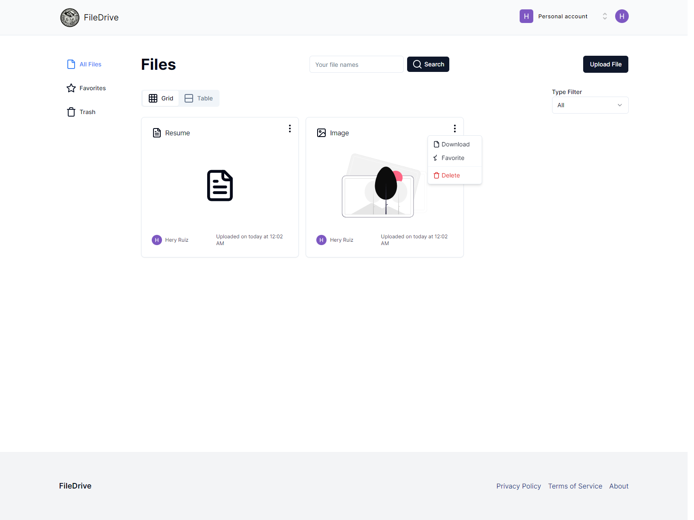

<h2>About the project</h2>

File Drive is a modern file management application designed for seamless storage and organization of digital assets. Developed with Convex for backend stability and Clerk for streamlined authentication, this platform prioritizes security and accessibility. Powered by Next.js, TypeScript, and HTML, File Drive offers dynamic interfaces, optimizing user interaction and experience. Whether for individual or organizational use, this innovative solution provides secure and efficient file storage, simplifying data management tasks with ease.

👉 Live Demo: <a href='https://filedrives.vercel.app'>File Drive Demo</a>

<h3>Built using:</h3>
» Convex  
» Clerk  
» Next.js 
» TypeScript  
» HTML 

 

<h2>Project Screenshots</h2>
 
<h3 align='center'>Home Page 🏠</h3>

  

  

<h3 align='center'>Files 📁</h3>

  

  
<h3 align='center'>Trash 🗑️</h3>

  

  