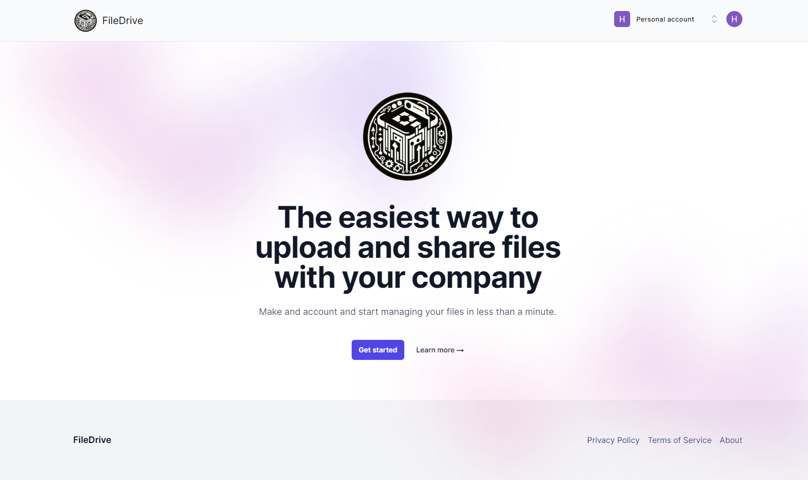
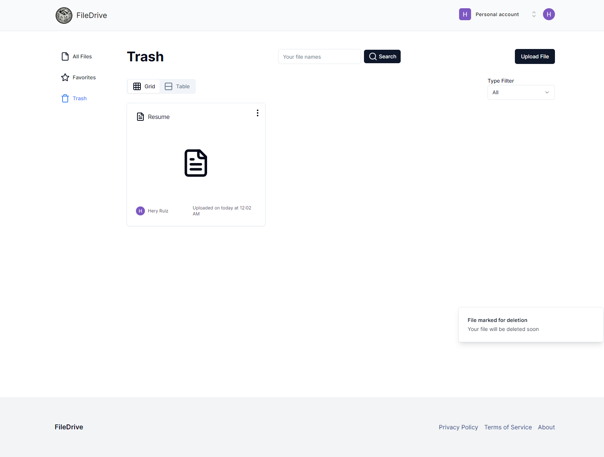

<h2>About the project</h2>

The project successfully integrated the Coingecko API to enrich user experience with real-time data on the top 50 cryptocurrencies. State management techniques were applied in React to boost application performance and user interactivity. Additionally, strategies like lazy loading for images and other optimization techniques were incorporated to enhance loading times and overall user experience. These efforts collectively aimed to create a more seamless and responsive platform for users interacting with cryptocurrency data.

👉 Live Demo: <a href='https://youcoin.vercel.app'>YouCoin Demo</a>

<h3>Built using:</h3>
» Convex  
» Clerk  
» Next.js 
» TypeScript  
» HTML 

 

<h2>Project Screenshots</h2>
 
<h3 align='center'>Home Page 🏠</h3>

  

  

<h3 align='center'>Files 💾</h3>

  

  
<h3 align='center'>Trash 🗑️</h3>

  

  